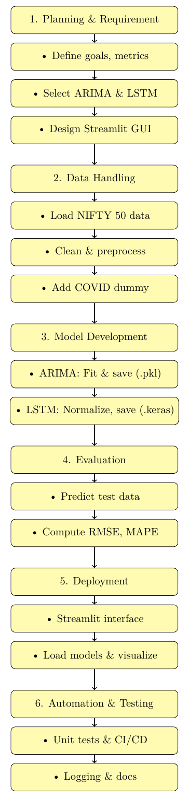
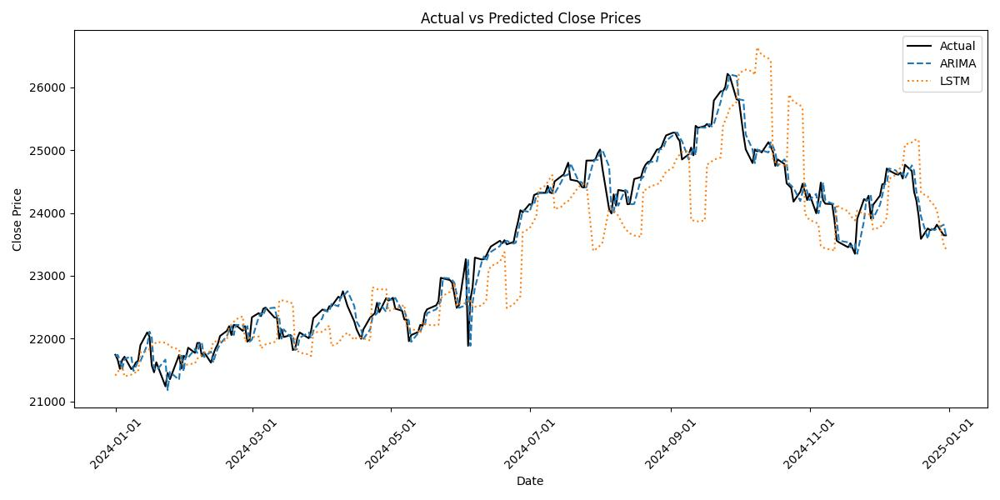
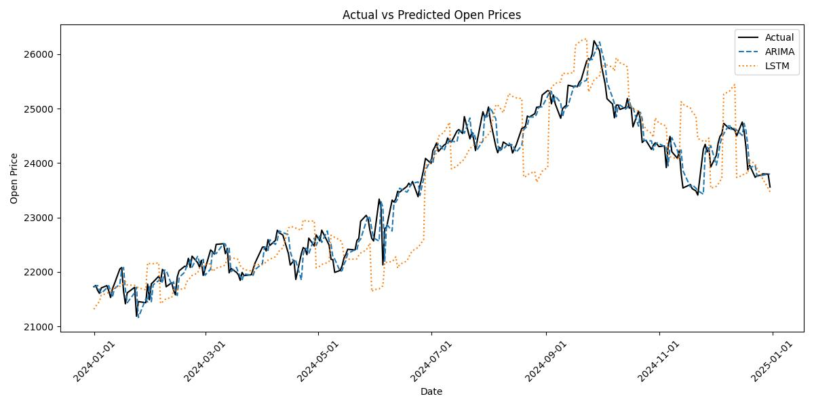

# NIFTY 50 Forecasting Project

**🔗 Live Demo:** [nifty50indexprediction.streamlit.app](https://nifty50indexprediction.streamlit.app/)

This project implements a walk‑forward one‑step forecasting framework for the NIFTY 50 stock index using two different modeling approaches:

- **ARIMA:** A univariate time series model.  
- **LSTM:** A deep learning model designed to capture non‑linear relationships.

The project covers data loading, cleaning, and exploratory data analysis (EDA), as well as model tuning (using `autoArima` from pmdarima for ARIMA order selection), walk‑forward forecasting, and performance evaluation with visualizations.

---

## Table of Contents

- [Overview](#overview)  
- [Prerequisites](#prerequisites) 
- [Flowchart](#flowchart)  
- [Environment Setup](#environment-setup)  
  - [Creating a Virtual Environment](#creating-a-virtual-environment)  
  - [Installing Required Packages](#installing-required-packages)  
- [Usage](#usage)  
- [GUI](#gui)  
- [Testing](#testing)  
- [Continuous Integration](#continuous-integration)  
- [Manual and Report](#manual-and-report)  

---

## Overview

This project forecasted the daily opening and closing price of the NIFTY 50 index using historical data from 2008 to 2024. The dataset included:

- columns 'Close', 'High', 'Low', 'Open'
- A **COVID_dummy** to capture the market impact during COVID  

A walk‑forward one‑step forecasting approach was used, where models were updated daily (or at set intervals) using the most recent data. For ARIMA, `autoArima` selected the best (p, d, q) order on a rolling training window. The LSTM model was built using TensorFlow/Keras and retrained periodically for performance.

---

## Prerequisites

Before running the project, ensure you have:

- **Python 3.10 or 3.11** (recommended for TensorFlow compatibility)  
- Familiarity with Python, pandas, NumPy, and time‑series forecasting  
- A terminal or shell to execute commands  

---

## Flowchart




## Environment Setup

### Creating a Virtual Environment

```bash
cd /path/to/your/project
python3.10 -m venv myenv310
source myenv310/bin/activate      # macOS/Linux
myenv310\Scripts\activate         # Windows
```

### Installing Required Packages

```bash
pip install -r requirements.txt
```
---

## 📁 Project Directory Structure with Links

Below is the list of key folders and modules in this project along with clickable links:

### 🔹 Core Codebase

- [`Code/`](./Code) — Main codebase  
  - [`dataHandler/`](./Code/dataHandler) — Data loading and cleaning scripts  
    - [`dataHandler.py`](./Code/dataHandler/dataHandler.py)  
  - [`models/`](./Code/models) — Forecasting models  
    - [`arima/`](./Code/models/arima)  
      - [`arimaModel.py`](./Code/models/arima/arimaModel.py)  
    - [`lstm/`](./Code/models/lstm)  
      - [`lstmModel.py`](./Code/models/lstm/lstmModel.py)  
  - [`tests/`](./Code/tests) — Unit tests  
    - [`test_Arima_Model.py`](./Code/tests/test_Arima_Model.py)  
    - [`test_Lstm_Model.py`](./Code/tests/test_Lstm_Model.py)  
    - [`test_Data_Handler.py`](./Code/tests/test_Data_Handler.py)  
    - [`test_Main.py`](./Code/tests/test_Main.py)  
    - [`test_Config.py`](./Code/tests/test_Config.py)  
  - [`utils/`](./Code/utils) — Utilities like logging and message handlers  
  - [`config.py`](./Code/config.py) — Configuration settings  
  - [`main.py`](./Code/main.py) — Main script for forecasting  
  - [`messages.json`](./Code/messages.json) — Internationalized GUI messages  
  - [`Doxyfile`](./Code/Doxyfile) — Doxygen configuration for documentation  

---

### 🔹 Graphical User Interface (GUI)

- [`GUICode/`](./GUICode) — Streamlit GUI Application  
  - [`models/`](./GUICode/models) — Pretrained model files  
    - [`arimaModelClose.pkl`](./GUICode/models/arimaModelClose.pkl)  
    - [`arimaModelOpen.pkl`](./GUICode/models/arimaModelOpen.pkl)  
    - [`lstmModelClose.keras`](./GUICode/models/lstmModelClose.keras)  
    - [`lstmModelOpen.keras`](./GUICode/models/lstmModelOpen.keras)  
    - [`scalerClose.pkl`](./GUICode/models/scalerClose.pkl)  
    - [`scalerOpen.pkl`](./GUICode/models/scalerOpen.pkl)  
  - [`Code/.streamlit/`](./GUICode/Code/.streamlit) — Streamlit app configuration  
  - [`Code/docs/`](./GUICode/Code/docs) — GUI-related docs and visuals  
  - [`errorHandler.py`](./GUICode/errorHandler.py) — GUI error handling  
  - [`messages.json`](./GUICode/messages.json) — UI strings for i18n  
  - [`stockPredictorGui.py`](./GUICode/stockPredictorGui.py) — Main GUI script  
  - [`requirements.txt`](./GUICode/requirements.txt) — Dependencies for GUI  

---

### 🔹 Supporting Documentation

- [`Manual/`](./Manual) — System manuals (user/technical)  
- [`report/`](./report) — Final technical report (LaTeX)  
- [`Presentations/`](./Presentations) — All presentation slide decks  
- [`Poster/`](./Poster) — Project poster  
- [`ProjectManagement/`](./ProjectManagement) — Gantt chart, timelines, plans  
- [`InitialProjectPlan/`](./InitialProjectPlan) — Early scope documents  
- [`Documents/`](./Documents) — Misc. notes and attachments  

---

### 🔹 Root-Level Files

- [`README.md`](./README.md) — Project overview  
- [`Requirements.txt`](./Requirements.txt) — Global dependency list  
- [`Makefile`](./Makefile) — Testing and automation commands  
- [`cached_nifty50.csv`](./cached_nifty50.csv) — Static NIFTY 50 dataset  
- [`forecast_results.csv`](./forecast_results.csv) — Results summary  
- [`forecast_plot_Open.png`](./forecast_plot_Open.png) — Open forecast graph  
- [`forecast_plot_Close.png`](./forecast_plot_Close.png) — Close forecast graph  
- [`log.txt`](./log.txt) — Application logs  
- [`author.xlsx`](./author.xlsx) — Author contributions  
- [`.gitignore`](./.gitignore) — Git exclusion rules  
- [`.python-version`](./.python-version) — Python version file  

---


## Usage

To run the full forecasting pipeline:

```bash
python Code/main.py
```

This script:

- Downloads NIFTY 50 data via `yfinance`  
- Trains ARIMA and LSTM models  
- Predicts next-day Open/Close prices  
- Evaluates RMSE and MAPE for backtesting  

---

## GUI

An interactive graphical user interface is provided under the `GUICode/` folder. It allows non-technical users to visualize and use the forecasting models easily.

**Key Features:**

- Model selection: Choose between pretrained **ARIMA** or **LSTM**  
- Date input: Select a forecast date using a calendar widget  
- Result visualization: Compare actual vs. predicted values for Open and Close prices  
- Upload feature: If the selected date is beyond the pretrained model's scope, the GUI prompts for new data upload  
- Error metrics: Displays RMSE and MAPE if actual values are available

**Running the GUI:**

```bash
cd GUICode
python stock_predictor_gui.py
```

**Dependencies:**

- `PyQt6` for the GUI framework  
- `tensorflow`, `pmdarima`, `pandas`, and `sklearn` for backend logic  
- The GUI uses pre-saved models (`lstmModel.keras`, `arima_model.pkl`) and scalers for fast performance

---

## Testing

To run automated tests:

```bash
make test
```

Or directly:

```bash
pytest Code/tests --maxfail=1 --disable-warnings -q
```

Test modules:

- `test_data_handler.py`  
- `test_config.py`  
- `test_arima_model.py`  
- `test_lstm_model.py`  
- `test_main.py`  

---

## Continuous Integration

GitHub Actions is configured to test the project automatically using `.github/workflows/ci.yml` with Python 3.10 on each push or pull request.

---

## Manual and Report

- 📘 **Manual**: See [`Manual/`](./Manual/) for user and technical documentation (including GUI usage and setup).  
- 📄 **Report**: See [`report/`](./report/) for the final methodology, visualizations, and evaluation summaries.  

These files explain the system design and results in detail and support replication and future maintenance.


## Results



---

